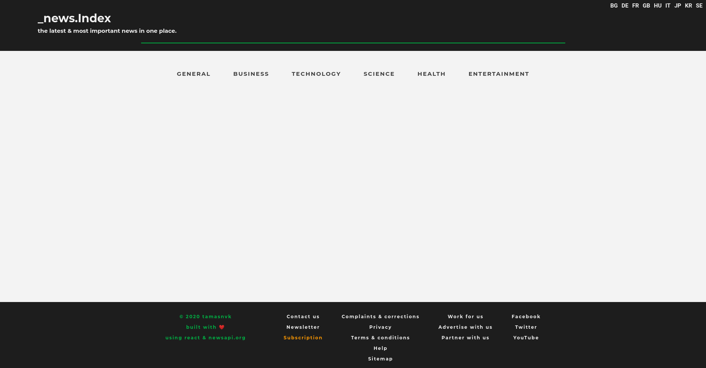

### news_index || project-002
#### description
+ an Express/React/Node application that fetches and displays news items based on various country/category selections.
+ the API is served from [newsapi.org](https://newsapi.org/).
+ to run the application:
  +  sign up for a key;
  +  copy it to .env_sample;
  +  rename the file to .env, install the project dependencies with package.json and run the application;
  +  OR visit the heroku deployed version [here](https://newsindex.herokuapp.com/).

#### project structure
```
*
|- .env_sample
|- .gitignore
|- license
|- package.json
|- package-lock.json
|- readme.md
|- screenshot.png
|- server.js
|- CLIENT
  |- .gitignore
  |- package.json
  |- package-lock.json
  |- PUBLIC
    |- favicon.ico
    |- index.html
  |- SRC
    |- index.js
    |- COMPONENTS
      |- App.js
      |- ContentCategories.js
      |- Footer.js
      |- MainNewsItems.js
      |- Navbar.js
      |- SideNewsItems.js
|- ROUTES
  |- fetchData.js
```

#### used packages
```
BACKEND
+ axios                - making api calls.
+ cors                 - cors enabling middleware.
+ dotenv               - loading an .env variable to store not-public configuration data.
+ express              - server framework.
+ helmet               - securing express.

FRONTEND
+ axios                - making api calls.
+ react                - front-end framework.
+ react-ga             - google analytics package.
+ react-router-dom     - routing.
+ styled-components    - css-in-js styling.
```

#### screenshot
