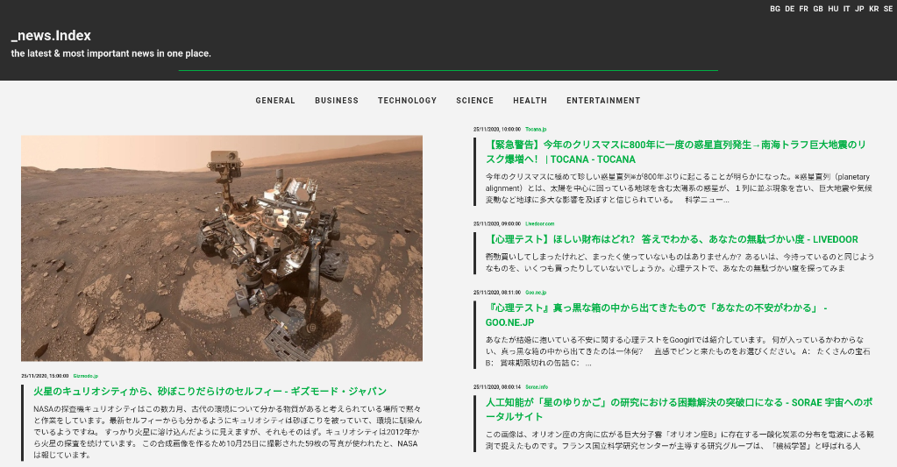

### news_index || project-002
#### description
+ a ReactJS front-end and NodeJS/NestJS back-end application that fetches and displays news items based on various country/category selections.
+ the third-party API is served from [newsapi.org](https://newsapi.org/).
+ visit the live version [here](https://tamasnovak.net/newsindex/?utm_source=github). The server-side code might need a minute or two to boot up as it is currently hosted on a free tier option @Heroku.

#### used packages
```
FRONT-END
+ axios                - http client.
+ react                - client-side framework.
+ react-ga             - google analytics package.
+ react-helmet         - document head manager.
+ react-router-dom     - routing.
+ styled-components    - css-in-js styling solution.
+ typescript           - javascript extension.

BACK-END
+ nestjs               - server-side framework.
+ typescript           - javascript extension.
```

#### screenshot
